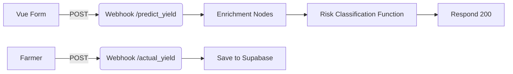

# 🌱 **EcoSystem⁺ Yield-Intelligence Platform**

End-to-end solution that lets Cameroonian farmers 🧑🏾‍🌾 get an **AI-driven crop-yield prediction**, receive a beautiful e-mail report, and later send back their real harvest so the model can keep learning.

---

## 📖 Table of Contents

1.  [High-Level Flow](#highlevel-flow)
2.  [Project Structure](#project-structure)
3.  [Quick Start](#quick-start)
4.  [Front-End (Vue 3)](#front-end)
5.  [Back-End (n8n workflow)](#back-end)
6.  [API Credentials](#api-credentials)
7.  [Developer Scripts](#developer-scripts)
8.  [Contributing](#contributing)

---

## ✨ High-Level Flow

• Farmer fills the **Yield Prediction Form** ➜ Vue sends POST → `/predict_yield` webhook.  
• n8n enriches with **free data sources** (Open-Meteo, SoilGrids, OpenStreetMap Nominatim) and calculates predicted yield & confidence.  
• n8n sends the JSON prediction straight back to the UI (no external e-mail step).  
• After harvest, farmer submits `/actual_yield` ➜ n8n stores the feedback in **Supabase** for future model tuning.



---

## 🗂️ Project Structure<a name="project-structure"></a>

```
RETRY N8N/
│  README.md                ← **You are here**
│  package.json             ← Vue dependencies & scripts
│  vite.config.js           ← Frontend build settings
│
├─ src/                     ← Vue 3 application
│   ├─ App.vue              ← Dashboard & result card
│   ├─ main.js              ← Entry point
│   ├─ style.css            ← Global Tailwind / custom CSS
│   ├─ components/
│   │   └─ YieldPredictionForm.vue
│   └─ data/
│       ├─ communes.js      ← >360 communes for dropdown
│       └─ crops.js         ← Crop catalogue
│
├─ n8n-workflow.json        ← Exported n8n flow (import this!)
└─ misc/                    ← Design assets, CSV constants, docs
```

---

## ⚡ Quick Start<a name="quick-start"></a>

### 1. Clone & Install
```bash
#⬇️ download
git clone <repo-url>
cd "RETRY N8N"

#⬇️ dependencies
npm install   # or yarn
```

### 2. Run the Front-End
```bash
npm run dev
# open http://localhost:3000
```

### 3. Import the n8n Workflow
1. Open your n8n instance → **Workflows ➜ Import from file**.  
2. Select `n8n-workflow.json`.  
3. Add the credentials listed below.  
4. Switch the workflow to **Active**.

### 4. Set Environment Variables
Create `.env` in n8n **and**/or your host OS (depending on deployment):
```
TOMORROW_IO_API_KEY=xxx
MAPBOX_TOKEN=xxx
SENDGRID_API_KEY=xxx
SUPER_BASE=...
```

---

## 🌐 Front-End Details<a name="front-end"></a>

• **Framework**: Vue 3 + Composition API + Vite.  
• **Styling**: Tailwind + custom glass-morphism utilities.  
• **Smart Inputs**: Searchable dropdowns for communes & crops, instant validation.  
• **State flow**:
  1. `submitForm()` calls `/predict_yield` webhook.  
  2. Shows animated leaf loader & progress bar.  
  3. Displays result card with confidence & factors.  
  4. Stores prediction in `localStorage` (6-month expiry) so the feedback UI can pop up later.  
  5. **Accuracy Feedback** card appears immediately; user can answer:
     • Yes – prediction correct.  
     • No – enters `actual_yield` (number) + `unit` (string).

### Config Points
•  API URLS in `src/components/YieldPredictionForm.vue → API_CONFIG`.  
•  Colors & fonts in `tailwind.config.js` and `src/style.css`.

---

## 🔧 Back-End (n8n) Details<a name="back-end"></a>

### Webhooks
• **/predict_yield** – receives `{crop_type, commune, farm_size, contact}`.  
• **/actual_yield**  – receives `{crop_type, commune, farm_size, actual_yield, unit, prediction_accurate, prediction_id}`.

### Blue Group – Enrichment
• GET coordinates → **OpenStreetMap Nominatim** (free) with fallback to OpenCage if rate-limited.  
• GET weather → **Open-Meteo** (free, no-key) – 7-day forecast + 30-day historical aggregates.  
• GET soil → **SoilGrids** (free).  
• Read crop constants CSV.  
• *Function* Risk Classification: calculates predicted yield per ha & total, confidence %, factors, recommendations.

#### How the Factors Influence Yield
• **Rainfall (mm)**  – Too little → water-stress penalty; too much → rot risk.  Optimal window adds up to +15 % to yield estimate.
• **Mean Temperature (°C)** – Each °C below/above the crop's optimal range incurs a −3 % adjustment.  Extreme heat (>38 °C) triggers a red flag in `factors[]`.
• **Soil pH** – The script linearly scales from +10 % (ideal pH) to −20 % (very acidic or alkaline).  
• **Organic Carbon (SOC)** – Higher SOC boosts nutrient availability; +0-8 % bonus.  
• **Bulk Density** – High density hampers root growth; yields drop if >1.6 g/cm³.  
• **Historical Baseline Yield** – Each crop has a baseline in `crop_constants.csv`; the above multipliers are applied to that baseline.

The resulting `predicted_yield_per_ha` is therefore:

```
baseline × rainfallFactor × tempFactor × pHFactor × socFactor × densityFactor
```

`confidence_percent` decreases if any API fails or if weather variance is high.

### Dark-Green Group – Packaging
• Strip heavy payloads, add `prediction_id`, respond to caller (JSON only).

### Feedback Loop
• Upsert into **Supabase** table `predictions` (`prediction_id` is unique).

### Error Handling
• All HTTP nodes set **Continue On Fail** so the function can downgrade `confidence_percent`.

---

## 🔑 API Credentials<a name="api-credentials"></a>

Only one credential is required:
• **Supabase** – `SUPABASE_URL` + `SUPABASE_SERVICE_KEY` (or the consolidated **SUPER_BASE** string).

The data-provider APIs used (Open-Meteo, SoilGrids, Nominatim) are completely free and need **no API keys**.

---

## 📜 Developer Scripts<a name="developer-scripts"></a>

| Script               | What it does              |
| -------------------- | ------------------------- |
| `npm run dev`        | Start Vite dev server     |
| `npm run build`      | Production build in `/dist` |
| `npm run preview`    | Preview built site locally |

---

## 🤝 Contributing<a name="contributing"></a>

1.  Fork → feature branch.  
2.  Update **docs + tests** with any change.  
3.  Run `npm run lint` & `npm run build`.  
4.  PR with clear description.

---

## 📄 License

© EcoSystem⁺ Agritech – all rights reserved.  Ask before re-using the code or workflow.

---

> Built with ❤️ and ☀️ for sustainable agriculture in Cameroon. 